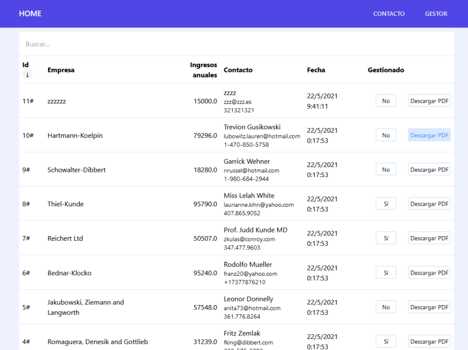

# holamundo

Aplicación Laravel + Vue.

## Pasos de instalación

1. Clonar o descargar y extraer el repositorio.

2. Abrir una terminal y entrar a la carpeta `holamundo`.

3. Ejecutar los siguientes comandos en la terminal:

    ```
    composer update

    npm install

    npm run dev
    ```

## Configuración de entorno

Renombrar el archivo `.env.example` a `.env`, o copiarlo para configurar los envíos de email. En este desarrollo se ha optado por usar mailtrap.

## Configuración de base de datos

Para probar en local se puede usar el driver **sqlite**. Para ello crear un archivo vacío en la carpeta `database` llamado `database.sqlite`.

Una vez configurada la base de datos, efecutar las migraciones con los seeders

```
php artisan:migrate --seed
```

## Ejecución

Levantar servidor local de desarrollo.

```
php artisan serve
```

Acceder a la url http://localhost:8000 o http://127.0.0.1:8000

## Recursos

Tailwind CSS

## Capturas de la aplicación

Formulario de contacto


Gestor de solicitudes



Gestor de solicitudes, ordenar por cualquier columna


Gestor de solicitudes, filtrar por búsqueda


Bandeja de entrada de Mailtrap


Visor y descarga del PDF


