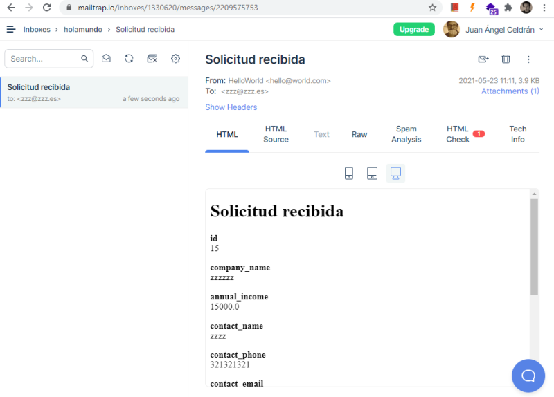

# holamundo

Aplicación Laravel + Vue.

## Pasos de instalación

1. Abrir terminal del SO.

2. Clonar o descargar y extraer el repositorio.

3. Entrar a la carpeta `holamundo` o donde se hayan extraido los archivos de la aplicación.

4. Ejecutar los siguientes comandos en la terminal:

    ```
    composer update

    npm installphp

    npm run dev
    ```

## Configuración de entorno

Renombrar el archivo `.env.example` a `.env`, o copiarlo y ajustar según preferencias.

## Configuración de correo

Configurar el driver de correo según preferencias en el archivo `.env`. En este desarrollo se ha optado por usar **mailtrap**.

```
MAIL_MAILER=smtp
MAIL_HOST=smtp.mailtrap.io
MAIL_PORT=2525
MAIL_USERNAME=username en mailtrap
MAIL_PASSWORD=password en mailtrap
MAIL_ENCRYPTION=tls
MAIL_FROM_ADDRESS=hello@world.com
MAIL_FROM_NAME="${APP_NAME}"
```

## Configuración de base de datos

Para probar en local se puede usar el driver **sqlite**. Para ello crear un archivo vacío en la carpeta `database` llamado `database.sqlite` y configurar las líneas correspondientes en el archivo `.env`

```
DB_CONNECTION=sqlite
# DB_HOST=127.0.0.1
# DB_PORT=3306
# DB_DATABASE=laravel
# DB_USERNAME=root
# DB_PASSWORD=
```

Una vez configurada la base de datos, efecutar las migraciones con seeders.

```
php artisan:migrate --seed
```

## Ejecución

Levantar servidor local de desarrollo.

```
php artisan serve
```

Acceder a la url http://localhost:8000 o http://127.0.0.1:8000

## Capturas de la aplicación

### Home


### Formulario de contacto


### Gestor de solicitudes

Hacer click en los nombres de las columnas indicadas para ordenar en sentido ascendente y descedente.

Hacer click en cada botón de la columna **Gestionado** para alternar el estado de gestionado a Sí/No.

Hacer click en cada enlace **Descargar PDF** para abrir en ventana aparte el PDF anexado a cada correo de respuesta de cada solicitud.


### Gestor de solicitudes, filtrar por búsqueda

La búsqueda se lanza automáticamente al alcanzar 3 caracteres.


### Bandeja de entrada de Mailtrap

El correo de notificación incluye un renderizado simple de todos los datos del formulario y un anexo en PDF con el mismo contenido.



### Visor y descarga del PDF

Al pulsar el botón de descarga de PDF, si existe, el archivo se sirve en línea. En caso contrario se compone usando el mismo método que al enviar la notificación.


