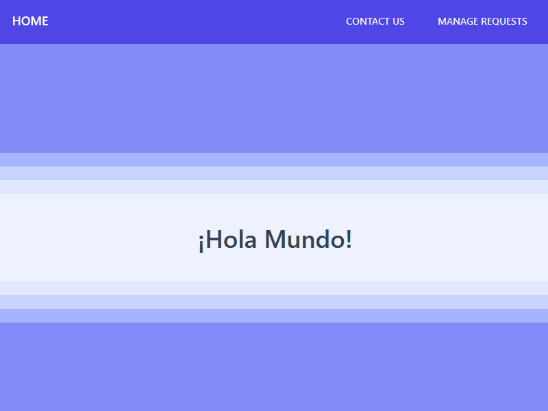
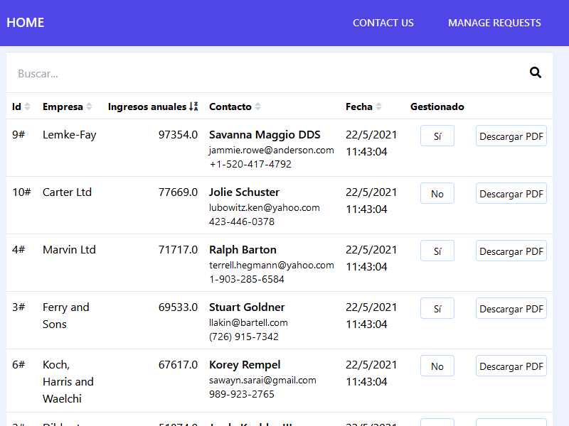

# holamundo

Aplicación Laravel + Vue.

## Pasos de instalación

1. Clonar o descargar y extraer el repositorio.

2. Abrir una terminal y entrar a la carpeta `holamundo`.

3. Ejecutar los siguientes comandos en la terminal:

    ```
    composer update

    npm install

    npm run dev
    ```

## Configuración de entorno

Renombrar el archivo `.env.example` a `.env`, o copiarlo para configurar los envíos de email. En este desarrollo se ha optado por usar mailtrap.

## Configuración de base de datos

Para probar en local se puede usar el driver **sqlite**. Para ello crear un archivo vacío en la carpeta `database` llamado `database.sqlite`.

Una vez configurada la base de datos, efecutar las migraciones con los seeders

```
php artisan:migrate --seed
```

## Ejecución

Levantar servidor local de desarrollo.

```
php artisan serve
```

Acceder a la url http://localhost:8000 o http://127.0.0.1:8000

## Capturas de la aplicación

### Home



### Formulario de contacto


### Gestor de solicitudes


### Gestor de solicitudes, ordenar por cualquier columna en sentido ascedente y descendente



### Gestor de solicitudes, filtrar por búsqueda

La búsqueda se lanza automáticamente al alcanzar 3 caracteres.


### Bandeja de entrada de Mailtrap

El correo de notificación incluye un renderizado simple de todos los datos del formulario y un anexo en PDF con el mismo contenido.


### Visor y descarga del PDF

Al pulsar el botón de descarga de PDF, si el archivo existe se sirve en línea. En caso contrario se compone usando el mismo método que al enviar la notificación.


